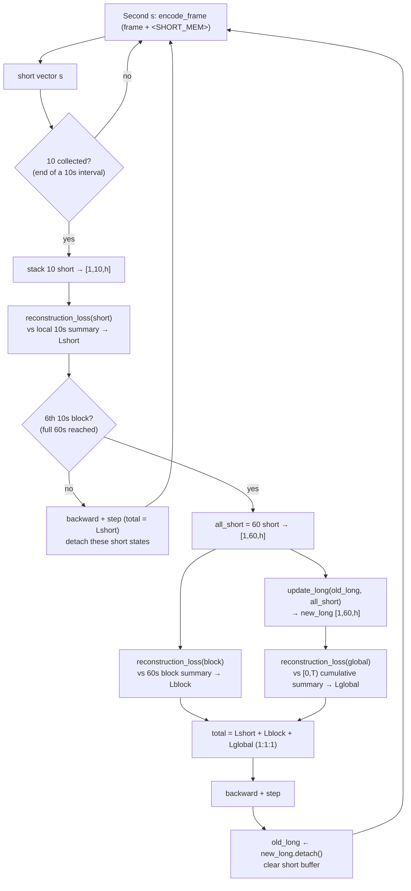

# Stage 2 — chronological visual memory

This is a new implementation. It does not import code from `pretrain/`.

## Memory flow (diagram)

The figures below are the token-level ground truth for how input frames, the two
memory query tokens, and reconstruction targets are arranged. They come directly
from `stage2/model.py` and `stage2/train.py`; line references are inline.

### Three forward passes (token arrangement)

```text
① encode_frame  — one per completed second → one SHORT vector   (model.py:50-65)
   each second is an INDEPENDENT forward (no KV carried across seconds):

      [chat header] <image tokens for this 1s> <SHORT_MEM> [chat footer]
                                                     │
                           take hidden state at <SHORT_MEM>  →  short vector [1, hidden]
   NOTE: <SHORT_MEM> appears exactly once (model.py:61-63); it only sees
         THIS one frame. Short memory has no cross-second context.

② update_long  — once every full 60s → replaces long memory      (model.py:67-79)

   first minute (no previous long):
      [ 60 SHORT vectors ] [ 60 × <LONG_MEM> query ]
   later minutes:
      [ old long (detached, 60) ] [ 60 SHORT vectors ] [ 60 × <LONG_MEM> query ]
      └──────── 60 ───────────┘ └──────── 60 ───────┘ └──────── 60 ────────┘
                                                               │
                take hidden states of the LAST 60 positions  →  new long memory [1, 60, hidden]
   NOTE: whole-block REPLACEMENT, not append. Length stays 60. Old long is
         detached (no gradient across minutes); history accumulates recursively.

③ reconstruction_loss — teacher-forced CE, training only        (model.py:81-102)

      [ memory vectors ] [ "Summarize ...(kind):\n" prompt ] [ target summary ] [EOS]
      └──── -100 ───────┘ └──────── -100 ──────────────────┘ └──── CE loss here ────┘
   NOTE: memory + prompt are masked to -100; loss is computed ONLY on the
         target summary tokens. memory = 10 short (short) / 60 short (block) /
         60 new long (global), chosen by `kind`.
```

### One minute of training (control flow)



### short vs long

| | `<SHORT_MEM>` | `<LONG_MEM>` |
|---|---|---|
| Produced every | 1 second | 60 seconds |
| Sees | only its own 1 frame | old long + current 60 short |
| Count per readout | 1 vector | 60 vectors (fixed) |
| Across time | independent per-second snapshot, no accumulation | recursive, whole-block replacement, carries history |
| Supervised by | local 10s summary (per 10 vectors) | global `[0,T)` cumulative summary |

Inference (`stage2/stream.py:14-31`) runs only ① and ② (no teacher labels) and
saves `final_long [1,60,h]`, `final_short [1,k,h]` (`k<60`), and per-minute
snapshots for the later QA stage. The local/block/global text summaries exist
only as training targets to make the memory vectors reconstructable.

## Overview

Input is 1 frame per completed second. A `<SHORT_MEM>` hidden state becomes one
continuous short-memory vector. Every 10 states reconstruct the corresponding
teacher 10-second visual summary and trigger an optimizer step. At each full
minute, the final short loss, the 60-second block-summary loss, and the global
summary loss are summed with weights 1:1:1 for one step. The update reads the
previous detached 60-vector long memory and all 60 current short vectors; 60
repeated `<LONG_MEM>` query positions produce the replacement long memory.
Earlier short states are detached after their 10-second step and retained until
the minute boundary. State is reset between videos and epochs. No ASR is read.

Generate visual-only teacher labels from silent video clips using a multimodal
model on an OpenAI-compatible Chat Completions endpoint. For Gemini via
OpenRouter, set `OPENROUTER_API_KEY`:

```bash
python -m stage2.annotate --video /path/to/video1.mp4 \
  --video-id video1 --model google/gemini-3.1-pro-preview \
  --base-url https://openrouter.ai/api/v1 \
  --api-key-env OPENROUTER_API_KEY \
  --output /path/to/video1_teacher.jsonl
```

For local Qwen3.5 on vLLM, use `--model Qwen/Qwen3.5-35B-A3B`, its
`--base-url`, `--api-key-env VLLM_API_KEY`, and `--clip-dir` pointing into a
directory allowed by the vLLM server's local-media setting. The server must
share access to that filesystem. `--transport` defaults to OpenRouter's
base64 `file` content for Gemini and local `video_url` for other models, and
can be set explicitly. `--video-fps` optionally overrides vLLM video decoding;
by default the backend controls it. The
annotator creates exact silent video windows; it does not select image frames
or pass audio/ASR. The provider can still sample or limit frames internally.
At every complete minute boundary `T`, it
writes exactly **eight JSONL records**: six local labels for
`[T-60,T-50)`, ..., `[T-10,T)`; one independent block label for
`[T-60,T)`; and one cumulative label for `[0,T)`. For example, at `T=60`,
the windows are `0-10`, `10-20`, `20-30`, `30-40`, `40-50`, `50-60`,
`0-60` (block), and `0-60` (global). The last two have different
`label_type` values and different prompts despite sharing a window at the
first minute. At `T=120`, the block window is `60-120` and the global window
is `0-120`. For an incomplete
last minute, it labels only complete 10-second intervals. A failed call leaves
earlier **complete** blocks on disk; run with `--resume` to continue. Existing
output is protected unless `--resume` or `--overwrite` is explicit. Longer
global clips increase input cost and may hit the provider's duration, size, or
context limits. Teacher summaries still require visual-quality review.

`stage2.build_data` groups the eight event records into one chronological
training block while checking that all eight targets and windows are present:

```bash
python -m stage2.build_data \
  --teacher-jsonl /path/to/video1_teacher.jsonl /path/to/video2_teacher.jsonl \
  --output /path/to/blocks.jsonl
```

The builder accepts either block rows with `local_sub_summaries`,
`block_summary_target`, and `global_summary_target`, or event rows with
`label_type` = `local_10s` / `block_60s` / `global_prefix`, plus `video_id`,
`block_window`, `window`, and `target`. It checks chronology, all six 10-second
windows, independent 60-second and cumulative targets, and optional
`block_summary_window` / `global_window`. A legacy file containing only one
60-second `local_summary_target` per block is rejected; the missing 10-second
and independent block labels cannot be reconstructed from it.

The resulting JSONL contains one chronological block per row:

```json
{"video_id":"video1","block_window":[0,60],"local_sub_summaries":[{"window":[0,10],"local_summary_target":"..."}],"block_summary_target":"...","global_summary_target":"..."}
```

For a full block, provide **six** 10-second `local_sub_summaries`; the compact
example above shows only the first entry. A last incomplete block may contain
fewer complete 10-second labels; it never triggers a long update. Labels must
be visual-only summaries generated from exactly their stated video intervals.

```bash
python -m stage2.train --train-jsonl /path/to/blocks.jsonl \
  --video-path-map /path/to/video_path_map.json \
  --output-dir /path/to/stage2_output \
  --init-adapter /path/to/stage1_output/final
python -m stage2.stream --video /path/to/video.mp4 \
  --adapter-path /path/to/stage2_output/final \
  --output /path/to/memory_state.pt
python -m stage2.evaluate --eval-jsonl /path/to/held_out_blocks.jsonl \
  --video-path-map /path/to/video_path_map.json \
  --adapter-path /path/to/stage2_output/final \
  --output /path/to/reconstruction_losses.jsonl
```

`--init-adapter` is optional. Training writes per-update component losses to
`training_metrics.jsonl`. Streaming output contains minute-boundary long
snapshots and final long/short tensors for a later QA stage. This implementation
has unit tests for chronology and loss scheduling, plus a held-out
teacher-forced reconstruction-loss evaluator. A complete Qwen3-VL GPU run and
generated-summary or downstream memory-quality evaluation remain to be performed.
Stage 2 uses PEFT's
`trainable_token_indices` to train only the two new query-token embeddings
alongside LoRA; use a PEFT version that supports this option. If Stage 1 was
merged before Stage 2 training, streaming reads that adapter path from the
adjacent `training_config.json`; supply `--base-adapter` if the path moved.
